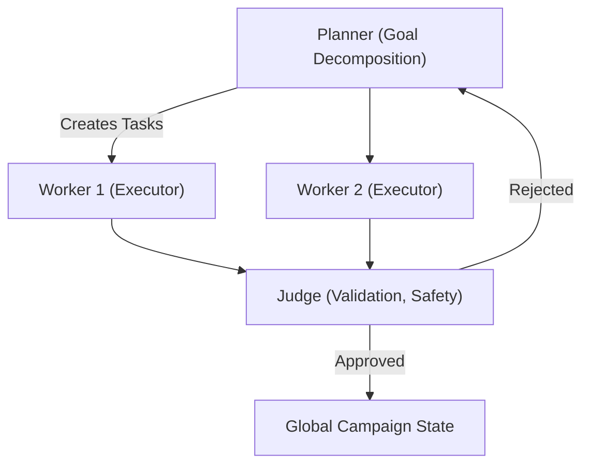
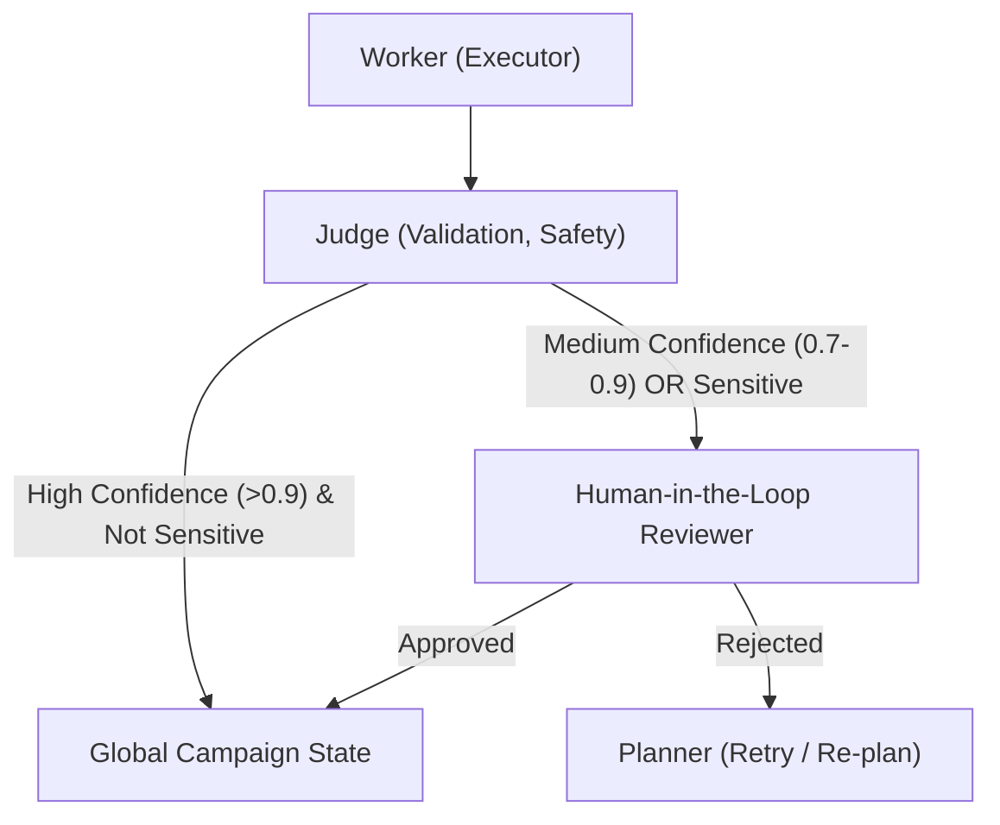
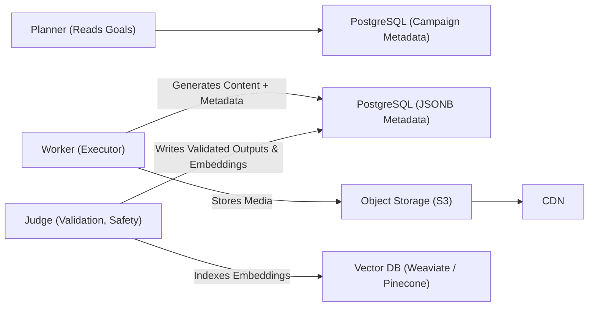

# Project Chimera Architecture Strategy

**Objective:** Define the architecture guiding Project Chimera to ensure scalability, safety, and maintainability. This document serves as a blueprint for developers and stakeholders.

---

## 1. Agent Pattern

### Recommended Pattern: Hierarchical Swarm (Planner → Worker → Judge)

**Rationale:**

The hierarchical swarm pattern is selected over alternatives like the **Sequential Chain** because it allows **high parallelism**, **fault isolation**, and **dynamic task decomposition**, which are critical for Chimera’s multi-task AI agents.

**Advantages over Sequential Chain:**

| Feature                    | Hierarchical Swarm                                       | Sequential Chain                  |
| -------------------------- | -------------------------------------------------------- | --------------------------------- |
| Parallelism                | High (multiple Workers run simultaneously)               | Low (tasks run one after another) |
| Fault tolerance            | Worker failures are isolated; Judges prevent propagation | Any failure halts the chain       |
| Quality control            | Judges act as validation and safety gate                 | Minimal automated validation      |
| Scalability                | Horizontal scaling possible                              | Limited by sequential dependency  |
| Dynamic task decomposition | Planners can spawn sub-planners and retries              | Not easily decomposable           |

**Mermaid Diagram: Swarm Coordination**

---

## 2. Human-in-the-Loop (HITL) — Safety Layer

### Placement & Decision Logic

HITL is integrated at the Judge level to handle **uncertain or sensitive outputs**. This ensures AI decisions meet safety and policy standards before committing to global state.

**Decision thresholds:**

* **Low confidence (<0.70):** Automatically reject or retry.
* **Medium confidence (0.70–0.90):** Queue for human review.
* **High confidence (>0.90):** Auto-approve, unless sensitive.

**Sensitive-topic override:** Any regulated content (politics, legal, health, finance) triggers mandatory HITL review.

**Advantages over fully automated pipelines:**

| Feature     | HITL Layer                            | Fully Automated Pipeline             |
| ----------- | ------------------------------------- | ------------------------------------ |
| Safety      | Human review prevents risky content   | Only algorithmic checks, higher risk |
| Compliance  | Mandatory review for sensitive topics | May violate regulations              |
| Flexibility | Configurable thresholds per campaign  | Fixed automation                     |

**Mermaid Diagram: HITL Integration**

---

## 3. Database Strategy: Hybrid (SQL + NoSQL + Vector DB)

**Rationale:**

Chimera requires storing **high-velocity metadata**, **transactional campaign data**, and **semantic embeddings**. A hybrid approach balances performance, consistency, and flexibility.

| DB Type                       | Role                                | Why chosen over counterpart                              |
| ----------------------------- | ----------------------------------- | -------------------------------------------------------- |
| PostgreSQL (SQL)              | Campaign metadata, ACLs, audit logs | Better ACID guarantees than NoSQL for transactional data |
| PostgreSQL (JSONB)            | High-velocity video/image metadata  | Schema flexibility with ACID safety via JSONB indexing   |
| Vector DB (Weaviate/Pinecone) | Semantic memory, embeddings         | Specialized similarity search vs SQL/NoSQL               |

**Mermaid Diagram: Data Flow**

**Additional considerations:**

* **Caching:** Redis for hot items and short-term memory.
* **Sharding:** Partition NoSQL collections by tenant/time for performance.
* **Audit logs:** Immutable append-only storage for compliance.

---

## 4. Operational & Safety Considerations

### Autoscaling & Resilience

* Workers are **stateless containers** on Kubernetes with HPA (queue length/CPU metrics).
* Planners and orchestrators are horizontally scalable, leader election ensures a single active planner per campaign.
* Vector DB and PostgreSQL run in **clustered, managed deployments** with replication and read replicas.

### Failover

* Persistent task queues (Redis/Streams) with durable consumer groups.
* Circuit breakers to prevent cascading failures from external tools.
* Graceful degradation: read-only or limited functionality under resource constraints.

### Observability & Auditing

* Structured logs (JSON) with centralized aggregation (ELK / OpenSearch).
* Metrics and tracing via Prometheus + Grafana + distributed tracing (Jaeger / OpenTelemetry).
* Security & audit: signed action logs, immutable ledgers, encrypted audit exports.

### Security

* Agent identity via signed IDs and PKI; keys stored in Vault.
* Policy enforcement at multiple layers: Judge (runtime), MCP Server (edge), BoardKit (global policy updates via GitOps).

