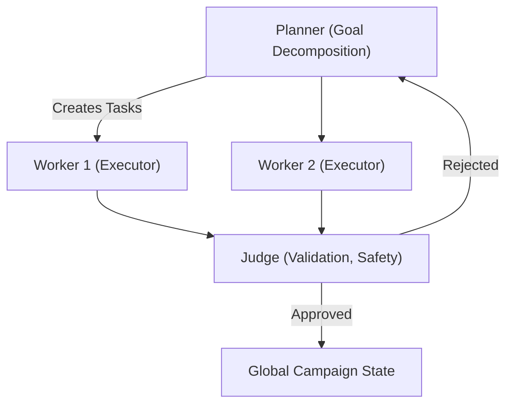

# Task 1.2: Domain Architecture Strategy

**Objective:** Define the architecture guiding Project Chimera to ensure scalability, safety, and maintainability. This document is a developer- and stakeholder-facing blueprint.

**Estimated effort:** 3 hours (scoping, diagrams, and actionable recommendations)

---

## 1. Agent Pattern 

### Recommendation: Hierarchical Swarm (Planner → Worker → Judge)

Why this fits Chimera:

- High parallelism: Workers are stateless and scale horizontally to handle bursts (replies, media generation, trend detection).
- Fault tolerance & isolation: Worker failures are contained; Judges act as gates preventing faulty outputs from committing.
- Quality control: Judges provide an automated validation layer (confidence scoring, safety filters) before state changes.
- Dynamic decomposition & self-healing: Planners re-plan on failure and spawn re-tries or sub-planners for complex tasks.
- Matches SRS patterns (FastRender, Planner/Worker/Judge) and supports economic & identity primitives (Agentic Commerce, SOUL.md).

Mermaid diagram (Swarm coordination):



---

## 2. Human-in-the-Loop (HITL) — Safety Layer

### Placement & Decision Logic

- Judges are the primary HITL gate: they route outputs based on confidence and sensitivity.
- Decision thresholds (configurable):
  - Low confidence: < 0.70 → **Reject / Retry** automatically (or escalate depending on policy)
  - Medium confidence: 0.70–0.90 → **Queue for HITL** (async approval)
  - High confidence: > 0.90 → **Auto-Approve** (subject to sensitive topic override)
- Sensitive-topic override: any content matching regulated/sensitive categories (politics, legal, health, financial advice) forces HITL regardless of confidence.

Mermaid diagram (HITL integration):

```mermaid
flowchart TD
    Worker --> Judge
    Judge -->|High Confidence (>0.9) & Not Sensitive| GlobalState
    Judge -->|Medium Confidence (0.7-0.9) OR Sensitive| HITL["Human-in-the-Loop Reviewer"]
    HITL -->|Approved| GlobalState
    HITL -->|Rejected| Planner
```

---

## 3. Database Strategy: Hybrid (SQL + NoSQL + Vector DB)

### Rationale & Roles

- **PostgreSQL (SQL):** canonical store for campaign metadata, account management, access control lists, and critical transactional business records (ACID guarantees).
  - Use for: user accounts, campaign configs, audit metadata, policy versions.
- **NoSQL (e.g., MongoDB, DynamoDB):** high-velocity video/image metadata and denormalized query access (fast writes and flexible schema).
  - Use for: streaming writes of content metadata, thumbnails, upload statuses, processing pipelines.
- **Vector DB (Weaviate / Pinecone):** semantic memories, embeddings, RAG retrievals for persona/history search.
  - Use for: long-term memory, similarity search, persona recall.

Mermaid diagram (Data flow):

```mermaid
flowchart TD
    Worker -->|Generates Content + Metadata| NoSQL["NoSQL DB (Video/Image Metadata)"]
    Worker -->|Stores Media| S3["Object Storage (S3)"]
    Planner -->|Reads Goals| SQL["PostgreSQL (Campaign Metadata)"]
    Judge -->|Writes Validated Outputs & Embeddings| NoSQL
    Judge -->|Indexes Embeddings| VectorDB["Weaviate / Vector DB"]
    CDN["CDN"] <-- S3
```

Design considerations:
- Use write-through cache (Redis) for hot items (recent posts, short-term episodic memory) to meet 10-second interaction SLAs.
- Partition/Shard NoSQL collections by tenant and time-window for efficient retention policies.
- Keep long-term audit logs in append-only storage (immutable store / ledger) for compliance.

---

## 4. Operational & Safety Concerns (scalability, failover, logging)

### Autoscaling & Resilience
- Run Workers as stateless containers on K8s (Horizontal Pod Autoscaler based on queue length / CPU / custom metrics).
- Keep Orchestrator & Planner horizontally scalable and largely stateless; use leader-election for single-active planner per campaign if needed.
- Vector DB and PostgreSQL should be deployed in clustered, managed modes (replication, read replicas). Use connection pooling for DB clients.

### Failover
- Task queue (Redis/Stream) with persistence and durable consumer groups.
- Circuit breakers on external MCP Tools to prevent cascading failures (rate-limit/backoff patterns).
- Graceful degradation: revert to reduced functionality (read-only, no media generation) under resource constraints.

### Observability & Auditing
- Structured logs (JSON) + centralized aggregator (ELK/Opensearch).
- Metrics & tracing: Prometheus + Grafana + distributed tracing (Jaeger / OpenTelemetry).
- Security/Audit trails: Signed action logs, immutable transaction ledger (on-chain for payments), and encrypted audit exports.

### Security
- Agent identity: signed agent IDs, public-key infrastructure (PKI), and key material stored in Vault.
- Policy enforcement at multiple layers: Judge (runtime), MCP Server (edge enforcement), and BoardKit (global policy updates via GitOps).

---
